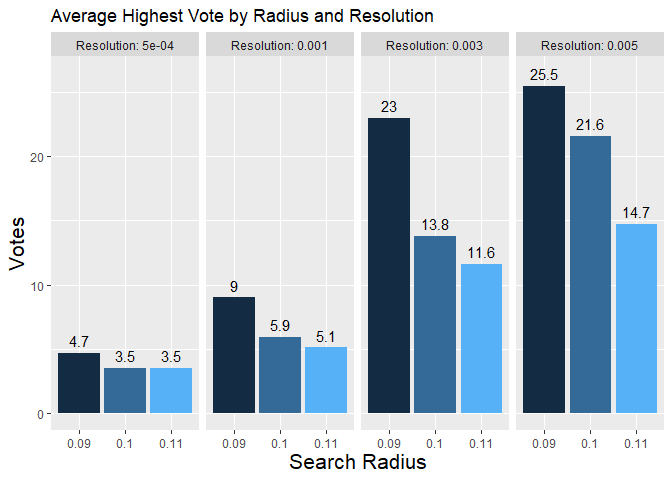

# Graphs {.tabset .tabset-fade .tabset-pills}

- NOTE THE CHANGE IN SCALE BETWEEN THE GRAPHS - SCALES MAY BE INDEPENDENT. 

## Line Graphs 

Insights: 

- Method 1 

- Method 1 

- Method 2 

### Data from test circle of radius 0.09

<!-- -->


### Data from test circle of radius 0.1

<!-- -->


### Data from test circle of radius 0.11

<!-- -->


## Distribution graphs

### Distribution of method 1

<!-- -->

### Overal Distribution of method 1

<!-- -->

### Distribution of Method 2

<!-- -->

### Overall Distribution of Method 2

<!-- -->

## Bar plots of Average Votes

Insights:

- Expected behavior on the bar graphs

### Overall Average Highest Votes


```
## `summarise()` has grouped output by 'Search Radius'. You can override using the `.groups` argument.
## `summarise()` has grouped output by 'Search Radius'. You can override using the `.groups` argument.
```

<!-- -->

### Average highest vote for test circle of 0.09


```
## `summarise()` has grouped output by 'Search Radius'. You can override using the `.groups` argument.
## `summarise()` has grouped output by 'Search Radius'. You can override using the `.groups` argument.
```

<!-- -->


### Average highest vote for test circle of 0.1


```
## `summarise()` has grouped output by 'Search Radius'. You can override using the `.groups` argument.
## `summarise()` has grouped output by 'Search Radius'. You can override using the `.groups` argument.
```

<!-- -->


### Average highest vote for test circle of 0.11


```
## `summarise()` has grouped output by 'Search Radius'. You can override using the `.groups` argument.
## `summarise()` has grouped output by 'Search Radius'. You can override using the `.groups` argument.
```

<!-- -->


## Average Layer mean 

Insights:

- Note the high confidence spikes of search radius of 0.099.


```
## `summarise()` has grouped output by 'Search Radius', 'Resolution', 'test_circle'. You can override using the `.groups` argument.
```

<!-- -->


