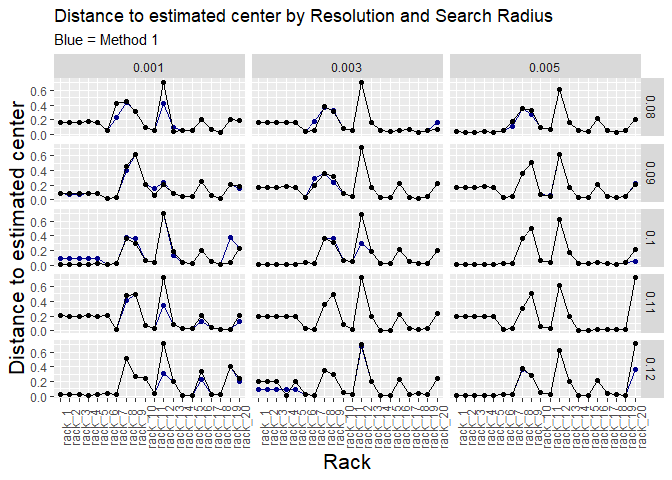
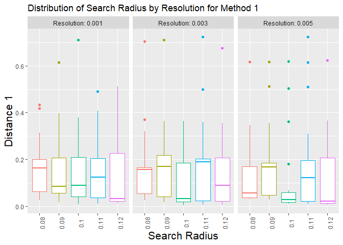
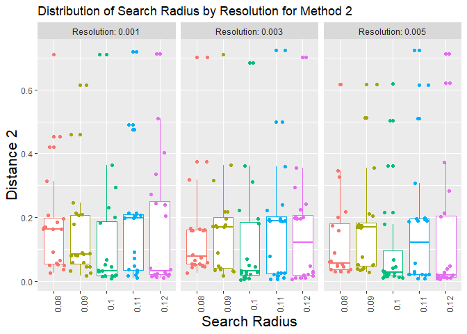
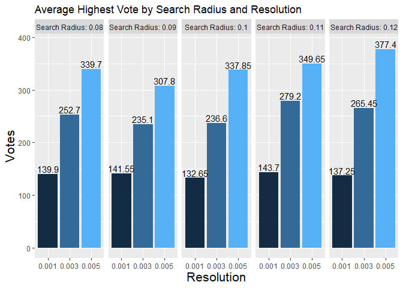
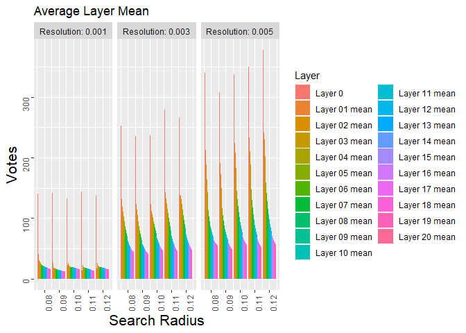
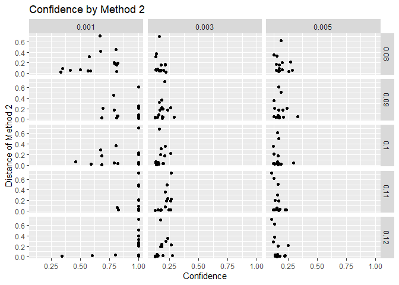

# Graphs {.tabset .tabset-fade .tabset-pills}

## Line Graphs {.tabset .tabset-pills}


```r
all %>% 
   # need to factor them in order
   ggplot(aes(group=Resolution)) +
   geom_point(aes(x=fct_inorder(as.factor(`File name`)), y=`Distance 1`), color="blue4") +
   geom_line(aes(x=fct_inorder(as.factor(`File name`)), y=`Distance 1`), color="blue4") +
   geom_point(aes(x=fct_inorder(as.factor(`File name`)), y=`Distance 2`)) +
   geom_line(aes(x=fct_inorder(as.factor(`File name`)), y=`Distance 2`)) + 
   facet_grid(`Search Radius`~Resolution) +
   labs(title = "Distance to estimated center by Resolution and Search Radius", 
        subtitle = "Blue = Method 1", 
        x = "Rack",
        y = "Distance to estimated center") +
   theme(axis.text.x = element_text(angle = 90), 
         axis.title.y = element_text(size = 16),
         axis.title.x = element_text(size = 16))
```

<!-- -->


## Distribution Graphs {.tabset .tabset-pills}


```r
all %>% 
   select(-`Distance 2`) %>% 
   ggplot(aes(fct_inorder(as.factor(`Search Radius`)), y=`Distance 1`, color=fct_inorder(as.factor(`Search Radius`)))) +
   #geom_point() +
    geom_boxplot() +
   #geom_jitter() +
   #gghighlight(`Search Radius` == 0.1) +
   facet_grid(~Resolution, labeller = label_both, scales = "free") +
   labs(title = "Distribution of Search Radius by Resolution for Method 1",
        y = "Distance 1", 
        x = "Search Radius") +
   theme(axis.text.x = element_text(angle = 90), 
         legend.position = "none", 
         axis.title.x = element_text(size = 16), 
         axis.title.y = element_text(size = 16))
```

<!-- -->


```r
all %>% 
   select(-`Distance 1`) %>% 
   ggplot(aes(fct_inorder(as.factor(`Search Radius`)), y=`Distance 2`,    color=fct_inorder(as.factor(`Search Radius`)))) +
   geom_boxplot() +
   geom_jitter() +
   #gghighlight(`Search Radius` == 0.1) +
   facet_grid(~Resolution, labeller = label_both, scales = "free") +
   labs(title = "Distribution of Search Radius by Resolution for Method 2",
        y = "Distance 2", 
        x = "Search Radius") +
   theme(axis.text.x = element_text(angle = 90), 
         legend.position = "none", 
         axis.title.x = element_text(size = 16), 
         axis.title.y = element_text(size = 16))
```

<!-- -->


## Bar Graphs {.tabset .tabset-pills}


```r
# get the average high vote from all search radii groupby resolution and facet_grid
# all %>% 
#    group_by(`File name`, `Search Radius`, Resolution) %>% 
#    summarise(avg_hv = mean(`Highest Vote`))

test <- all %>%
  group_by(`Search Radius`, Resolution) %>% 
  summarise(avg_high_vote = mean(`Highest Vote`)) %>% 
  round(., digits = 2) %>% 
  pull(avg_high_vote)


all %>% 
   group_by(`Search Radius`, Resolution) %>% 
   summarise(avg_hv = mean(`Highest Vote`)) %>%
   ggplot(aes(x=as.factor(Resolution), y=avg_hv, fill=Resolution)) +
   geom_col(position = "dodge") + 
   geom_text(aes(label=test), nudge_y = 10) +
   facet_grid(~`Search Radius`, labeller = label_both) +
   labs(title = "Average Highest Vote by Search Radius and Resolution", 
        y= "Votes", 
        x= "Resolution") +
   theme(legend.position = "none", 
         axis.title.x = element_text(size = 16), 
         axis.title.y = element_text(size = 16))
```

<!-- -->


## Average Layer Mean {.tabset .tabset-pills}


```r
# all_longer %>% 
# ggplot(aes(x=`Search Radius`, y=Layer_vote, group=Layer, fill=Layer)) +
#    geom_col(position = "dodge") +
#    facet_grid(~Resolution, labeller = label_both, scales = "free") +
#    labs(title = "Average Layer Mean", 
#         y= "Votes") +
#    theme(axis.text = element_text(angle = 90), 
#          axis.title.y = element_text(size = 16), 
#          axis.title.x = element_text(size = 16)) 

all_longer %>% 
   group_by(`Search Radius`, Resolution, Layer) %>% 
   summarise(layer_avg = mean(Layer_vote)) %>% 
   ggplot(aes(x=`Search Radius`, y=layer_avg, group=Layer, fill=Layer)) +
   geom_col(position = "dodge") +
   facet_grid(~Resolution, labeller = label_both, scales = "free") +
   labs(title = "Average Layer Mean", 
        y= "Votes") +
   theme(axis.text = element_text(angle = 90), 
         axis.title.y = element_text(size = 16), 
         axis.title.x = element_text(size = 16)) 
```

<!-- -->

### Table 


```r
avg_mean <- all_longer %>% 
   group_by(`Search Radius`, Resolution, Layer) %>% 
   summarise(layer_avg = mean(Layer_vote))
```

```
## `summarise()` regrouping output by 'Search Radius', 'Resolution' (override with `.groups` argument)
```

```r
datatable(avg_mean, class = 'cell-border stripe')
```

<!--html_preserve--><div id="htmlwidget-b6b3f5252ea3f8ea8e18" style="width:100%;height:auto;" class="datatables html-widget"></div>
<script type="application/json" data-for="htmlwidget-b6b3f5252ea3f8ea8e18">{"x":{"filter":"none","data":[["1","2","3","4","5","6","7","8","9","10","11","12","13","14","15","16","17","18","19","20","21","22","23","24","25","26","27","28","29","30","31","32","33","34","35","36","37","38","39","40","41","42","43","44","45","46","47","48","49","50","51","52","53","54","55","56","57","58","59","60","61","62","63","64","65","66","67","68","69","70","71","72","73","74","75","76","77","78","79","80","81","82","83","84","85","86","87","88","89","90","91","92","93","94","95","96","97","98","99","100","101","102","103","104","105","106","107","108","109","110","111","112","113","114","115","116","117","118","119","120","121","122","123","124","125","126","127","128","129","130","131","132","133","134","135","136","137","138","139","140","141","142","143","144","145","146","147","148","149","150","151","152","153","154","155","156","157","158","159","160","161","162","163","164","165","166","167","168","169","170","171","172","173","174","175","176","177","178","179","180","181","182","183","184","185","186","187","188","189","190","191","192","193","194","195","196","197","198","199","200","201","202","203","204","205","206","207","208","209","210","211","212","213","214","215","216","217","218","219","220","221","222","223","224","225","226","227","228","229","230","231","232","233","234","235","236","237","238","239","240","241","242","243","244","245","246","247","248","249","250","251","252","253","254","255","256","257","258","259","260","261","262","263","264","265","266","267","268","269","270","271","272","273","274","275","276","277","278","279","280","281","282","283","284","285","286","287","288","289","290","291","292","293","294","295","296","297","298","299","300","301","302","303","304","305","306","307","308","309","310","311","312","313","314","315"],[0.08,0.08,0.08,0.08,0.08,0.08,0.08,0.08,0.08,0.08,0.08,0.08,0.08,0.08,0.08,0.08,0.08,0.08,0.08,0.08,0.08,0.08,0.08,0.08,0.08,0.08,0.08,0.08,0.08,0.08,0.08,0.08,0.08,0.08,0.08,0.08,0.08,0.08,0.08,0.08,0.08,0.08,0.08,0.08,0.08,0.08,0.08,0.08,0.08,0.08,0.08,0.08,0.08,0.08,0.08,0.08,0.08,0.08,0.08,0.08,0.08,0.08,0.08,0.09,0.09,0.09,0.09,0.09,0.09,0.09,0.09,0.09,0.09,0.09,0.09,0.09,0.09,0.09,0.09,0.09,0.09,0.09,0.09,0.09,0.09,0.09,0.09,0.09,0.09,0.09,0.09,0.09,0.09,0.09,0.09,0.09,0.09,0.09,0.09,0.09,0.09,0.09,0.09,0.09,0.09,0.09,0.09,0.09,0.09,0.09,0.09,0.09,0.09,0.09,0.09,0.09,0.09,0.09,0.09,0.09,0.09,0.09,0.09,0.09,0.09,0.09,0.1,0.1,0.1,0.1,0.1,0.1,0.1,0.1,0.1,0.1,0.1,0.1,0.1,0.1,0.1,0.1,0.1,0.1,0.1,0.1,0.1,0.1,0.1,0.1,0.1,0.1,0.1,0.1,0.1,0.1,0.1,0.1,0.1,0.1,0.1,0.1,0.1,0.1,0.1,0.1,0.1,0.1,0.1,0.1,0.1,0.1,0.1,0.1,0.1,0.1,0.1,0.1,0.1,0.1,0.1,0.1,0.1,0.1,0.1,0.1,0.1,0.1,0.1,0.11,0.11,0.11,0.11,0.11,0.11,0.11,0.11,0.11,0.11,0.11,0.11,0.11,0.11,0.11,0.11,0.11,0.11,0.11,0.11,0.11,0.11,0.11,0.11,0.11,0.11,0.11,0.11,0.11,0.11,0.11,0.11,0.11,0.11,0.11,0.11,0.11,0.11,0.11,0.11,0.11,0.11,0.11,0.11,0.11,0.11,0.11,0.11,0.11,0.11,0.11,0.11,0.11,0.11,0.11,0.11,0.11,0.11,0.11,0.11,0.11,0.11,0.11,0.12,0.12,0.12,0.12,0.12,0.12,0.12,0.12,0.12,0.12,0.12,0.12,0.12,0.12,0.12,0.12,0.12,0.12,0.12,0.12,0.12,0.12,0.12,0.12,0.12,0.12,0.12,0.12,0.12,0.12,0.12,0.12,0.12,0.12,0.12,0.12,0.12,0.12,0.12,0.12,0.12,0.12,0.12,0.12,0.12,0.12,0.12,0.12,0.12,0.12,0.12,0.12,0.12,0.12,0.12,0.12,0.12,0.12,0.12,0.12,0.12,0.12,0.12],[0.001,0.001,0.001,0.001,0.001,0.001,0.001,0.001,0.001,0.001,0.001,0.001,0.001,0.001,0.001,0.001,0.001,0.001,0.001,0.001,0.001,0.003,0.003,0.003,0.003,0.003,0.003,0.003,0.003,0.003,0.003,0.003,0.003,0.003,0.003,0.003,0.003,0.003,0.003,0.003,0.003,0.003,0.005,0.005,0.005,0.005,0.005,0.005,0.005,0.005,0.005,0.005,0.005,0.005,0.005,0.005,0.005,0.005,0.005,0.005,0.005,0.005,0.005,0.001,0.001,0.001,0.001,0.001,0.001,0.001,0.001,0.001,0.001,0.001,0.001,0.001,0.001,0.001,0.001,0.001,0.001,0.001,0.001,0.001,0.003,0.003,0.003,0.003,0.003,0.003,0.003,0.003,0.003,0.003,0.003,0.003,0.003,0.003,0.003,0.003,0.003,0.003,0.003,0.003,0.003,0.005,0.005,0.005,0.005,0.005,0.005,0.005,0.005,0.005,0.005,0.005,0.005,0.005,0.005,0.005,0.005,0.005,0.005,0.005,0.005,0.005,0.001,0.001,0.001,0.001,0.001,0.001,0.001,0.001,0.001,0.001,0.001,0.001,0.001,0.001,0.001,0.001,0.001,0.001,0.001,0.001,0.001,0.003,0.003,0.003,0.003,0.003,0.003,0.003,0.003,0.003,0.003,0.003,0.003,0.003,0.003,0.003,0.003,0.003,0.003,0.003,0.003,0.003,0.005,0.005,0.005,0.005,0.005,0.005,0.005,0.005,0.005,0.005,0.005,0.005,0.005,0.005,0.005,0.005,0.005,0.005,0.005,0.005,0.005,0.001,0.001,0.001,0.001,0.001,0.001,0.001,0.001,0.001,0.001,0.001,0.001,0.001,0.001,0.001,0.001,0.001,0.001,0.001,0.001,0.001,0.003,0.003,0.003,0.003,0.003,0.003,0.003,0.003,0.003,0.003,0.003,0.003,0.003,0.003,0.003,0.003,0.003,0.003,0.003,0.003,0.003,0.005,0.005,0.005,0.005,0.005,0.005,0.005,0.005,0.005,0.005,0.005,0.005,0.005,0.005,0.005,0.005,0.005,0.005,0.005,0.005,0.005,0.001,0.001,0.001,0.001,0.001,0.001,0.001,0.001,0.001,0.001,0.001,0.001,0.001,0.001,0.001,0.001,0.001,0.001,0.001,0.001,0.001,0.003,0.003,0.003,0.003,0.003,0.003,0.003,0.003,0.003,0.003,0.003,0.003,0.003,0.003,0.003,0.003,0.003,0.003,0.003,0.003,0.003,0.005,0.005,0.005,0.005,0.005,0.005,0.005,0.005,0.005,0.005,0.005,0.005,0.005,0.005,0.005,0.005,0.005,0.005,0.005,0.005,0.005],["Layer 0","Layer 01 mean","Layer 02 mean","Layer 03 mean","Layer 04 mean","Layer 05 mean","Layer 06 mean","Layer 07 mean","Layer 08 mean","Layer 09 mean","Layer 10 mean","Layer 11 mean","Layer 12 mean","Layer 13 mean","Layer 14 mean","Layer 15 mean","Layer 16 mean","Layer 17 mean","Layer 18 mean","Layer 19 mean","Layer 20 mean","Layer 0","Layer 01 mean","Layer 02 mean","Layer 03 mean","Layer 04 mean","Layer 05 mean","Layer 06 mean","Layer 07 mean","Layer 08 mean","Layer 09 mean","Layer 10 mean","Layer 11 mean","Layer 12 mean","Layer 13 mean","Layer 14 mean","Layer 15 mean","Layer 16 mean","Layer 17 mean","Layer 18 mean","Layer 19 mean","Layer 20 mean","Layer 0","Layer 01 mean","Layer 02 mean","Layer 03 mean","Layer 04 mean","Layer 05 mean","Layer 06 mean","Layer 07 mean","Layer 08 mean","Layer 09 mean","Layer 10 mean","Layer 11 mean","Layer 12 mean","Layer 13 mean","Layer 14 mean","Layer 15 mean","Layer 16 mean","Layer 17 mean","Layer 18 mean","Layer 19 mean","Layer 20 mean","Layer 0","Layer 01 mean","Layer 02 mean","Layer 03 mean","Layer 04 mean","Layer 05 mean","Layer 06 mean","Layer 07 mean","Layer 08 mean","Layer 09 mean","Layer 10 mean","Layer 11 mean","Layer 12 mean","Layer 13 mean","Layer 14 mean","Layer 15 mean","Layer 16 mean","Layer 17 mean","Layer 18 mean","Layer 19 mean","Layer 20 mean","Layer 0","Layer 01 mean","Layer 02 mean","Layer 03 mean","Layer 04 mean","Layer 05 mean","Layer 06 mean","Layer 07 mean","Layer 08 mean","Layer 09 mean","Layer 10 mean","Layer 11 mean","Layer 12 mean","Layer 13 mean","Layer 14 mean","Layer 15 mean","Layer 16 mean","Layer 17 mean","Layer 18 mean","Layer 19 mean","Layer 20 mean","Layer 0","Layer 01 mean","Layer 02 mean","Layer 03 mean","Layer 04 mean","Layer 05 mean","Layer 06 mean","Layer 07 mean","Layer 08 mean","Layer 09 mean","Layer 10 mean","Layer 11 mean","Layer 12 mean","Layer 13 mean","Layer 14 mean","Layer 15 mean","Layer 16 mean","Layer 17 mean","Layer 18 mean","Layer 19 mean","Layer 20 mean","Layer 0","Layer 01 mean","Layer 02 mean","Layer 03 mean","Layer 04 mean","Layer 05 mean","Layer 06 mean","Layer 07 mean","Layer 08 mean","Layer 09 mean","Layer 10 mean","Layer 11 mean","Layer 12 mean","Layer 13 mean","Layer 14 mean","Layer 15 mean","Layer 16 mean","Layer 17 mean","Layer 18 mean","Layer 19 mean","Layer 20 mean","Layer 0","Layer 01 mean","Layer 02 mean","Layer 03 mean","Layer 04 mean","Layer 05 mean","Layer 06 mean","Layer 07 mean","Layer 08 mean","Layer 09 mean","Layer 10 mean","Layer 11 mean","Layer 12 mean","Layer 13 mean","Layer 14 mean","Layer 15 mean","Layer 16 mean","Layer 17 mean","Layer 18 mean","Layer 19 mean","Layer 20 mean","Layer 0","Layer 01 mean","Layer 02 mean","Layer 03 mean","Layer 04 mean","Layer 05 mean","Layer 06 mean","Layer 07 mean","Layer 08 mean","Layer 09 mean","Layer 10 mean","Layer 11 mean","Layer 12 mean","Layer 13 mean","Layer 14 mean","Layer 15 mean","Layer 16 mean","Layer 17 mean","Layer 18 mean","Layer 19 mean","Layer 20 mean","Layer 0","Layer 01 mean","Layer 02 mean","Layer 03 mean","Layer 04 mean","Layer 05 mean","Layer 06 mean","Layer 07 mean","Layer 08 mean","Layer 09 mean","Layer 10 mean","Layer 11 mean","Layer 12 mean","Layer 13 mean","Layer 14 mean","Layer 15 mean","Layer 16 mean","Layer 17 mean","Layer 18 mean","Layer 19 mean","Layer 20 mean","Layer 0","Layer 01 mean","Layer 02 mean","Layer 03 mean","Layer 04 mean","Layer 05 mean","Layer 06 mean","Layer 07 mean","Layer 08 mean","Layer 09 mean","Layer 10 mean","Layer 11 mean","Layer 12 mean","Layer 13 mean","Layer 14 mean","Layer 15 mean","Layer 16 mean","Layer 17 mean","Layer 18 mean","Layer 19 mean","Layer 20 mean","Layer 0","Layer 01 mean","Layer 02 mean","Layer 03 mean","Layer 04 mean","Layer 05 mean","Layer 06 mean","Layer 07 mean","Layer 08 mean","Layer 09 mean","Layer 10 mean","Layer 11 mean","Layer 12 mean","Layer 13 mean","Layer 14 mean","Layer 15 mean","Layer 16 mean","Layer 17 mean","Layer 18 mean","Layer 19 mean","Layer 20 mean","Layer 0","Layer 01 mean","Layer 02 mean","Layer 03 mean","Layer 04 mean","Layer 05 mean","Layer 06 mean","Layer 07 mean","Layer 08 mean","Layer 09 mean","Layer 10 mean","Layer 11 mean","Layer 12 mean","Layer 13 mean","Layer 14 mean","Layer 15 mean","Layer 16 mean","Layer 17 mean","Layer 18 mean","Layer 19 mean","Layer 20 mean","Layer 0","Layer 01 mean","Layer 02 mean","Layer 03 mean","Layer 04 mean","Layer 05 mean","Layer 06 mean","Layer 07 mean","Layer 08 mean","Layer 09 mean","Layer 10 mean","Layer 11 mean","Layer 12 mean","Layer 13 mean","Layer 14 mean","Layer 15 mean","Layer 16 mean","Layer 17 mean","Layer 18 mean","Layer 19 mean","Layer 20 mean","Layer 0","Layer 01 mean","Layer 02 mean","Layer 03 mean","Layer 04 mean","Layer 05 mean","Layer 06 mean","Layer 07 mean","Layer 08 mean","Layer 09 mean","Layer 10 mean","Layer 11 mean","Layer 12 mean","Layer 13 mean","Layer 14 mean","Layer 15 mean","Layer 16 mean","Layer 17 mean","Layer 18 mean","Layer 19 mean","Layer 20 mean"],[139.9,41.09375,30.414583334,27.6645833338,25.415,23.268750001,22.1803571432,22.13883928535,21.56215277775,20.7034722218,20.39443181925,20.0027462119,19.4227564109,19.07918955985,18.61732142825,18.11760416705,17.514568014,17.07773692755,16.6055921054,16.1717105258,15.7855654758,252.7,131.075,119.0124999905,111.089583341,103.10375,95.0279166645,87.083630956,81.0444196465,75.2211805535,70.3772222235,66.1262500045,62.2920454535,58.8907051285,55.852747251,53.195952377,50.7562499985,48.668566175,46.867401963,45.294444444,43.7749342105,42.4403571445,339.7,212.09375,188.11875,163.039583332,142.57125,125.970833344,113.124404758,102.4832589295,94.0114583325,87.0808333325,81.4952272675,76.9758522745,72.9521634635,69.667101649,66.6825000055,64.0176041625,61.7183364015,59.543137256,57.801133041,56.244375004,54.987529759,141.55,26.29375,17.37291666575,17.48437499985,17.02375,16.1912500005,15.5065476191,15.5053571431,15.18593749995,14.68027777745,14.4481818172,14.2066287876,13.8409455131,13.560508242,13.1179166662,12.86171874945,12.6312499997,12.5032679739,12.34364034995,12.06888157945,11.85136904795,235.1,123.5375,114.283333332,105.373958334,94.663125,86.577916663,79.3601190545,73.549107136,68.113541671,63.703888884,60.006250003,56.7449810635,54.03982372,51.735782968,49.546369047,47.5820833315,45.784191175,44.025531044,42.502960525,40.9999013195,39.613898806,307.8,190.44375,172.1458333385,150.001041682,131.263125,116.4700000115,104.5255952385,95.3562500035,88.221354165,82.1245833325,77.1938636415,72.3737689415,68.439983971,64.911813188,61.7847619045,58.9176041685,56.3525735245,54.0285539235,51.946052633,50.135032897,48.478958332,132.65,22.2375,25.63333333215,22.62812499865,20.09375,19.46208333295,18.6583333332,18.36674107145,18.5812499989,18.7026388886,18.83443181795,18.51022727325,18.1718749998,17.73131868175,17.4513690472,17.15723958265,16.9144301466,16.66102941175,16.3892909355,16.0097368417,15.61979166735,236.6,123.19375,111.697916658,107.0041666745,101.636875,95.0808333375,89.6622023755,84.5796875015,79.505555557,75.1691666635,70.6715909145,66.9422348435,63.466506413,60.29725275,57.4539880935,54.764010415,52.4470588315,50.225980389,48.2144736825,46.3219407885,44.519970237,337.85,224.16875,207.8708333385,182.929166665,161.083125,144.618749999,131.37589286,119.462276777,109.7434027825,101.179999993,93.7351136425,87.191856056,81.5452724345,76.5903846165,72.299702383,68.5038020825,65.211397055,62.349836602,59.799049712,57.499177629,55.4651488075,143.7,13.025,22.6395833328,18.81041666815,18.89875,18.3316666675,18.1642857143,17.69866071535,17.6451388888,17.11527777775,16.5945454546,16.43768939425,15.86850961515,15.5136675822,15.126190477,14.73916666565,14.3024816184,13.9627859484,13.65467836325,13.2203947368,12.92619047765,279.2,143.19375,132.947916669,124.545833337,115.470625,107.831666663,99.980654759,92.9236607125,86.4784722245,80.2284722225,74.7914772755,70.001325762,65.6905448655,61.8594093395,58.367321432,55.2390624965,52.509650731,50.027001632,47.7585160845,45.7483881615,43.9148214295,349.65,233.74375,210.160416667,188.693750008,166.75625,146.7712499895,130.6705357035,117.387723217,106.0140624995,96.733750005,89.092045464,82.5411931805,77.1009615395,72.4103708795,68.3185714255,64.8421874975,61.763419124,59.0150735255,56.5954678375,54.401348684,52.384107143,137.25,16.575,25.4333333333,21.0072916665,20.539375,18.8870833338,18.68720238035,18.76227678665,18.75607638935,18.95958333365,18.2993181809,18.34138257605,17.8291666679,17.6649725268,17.08077380965,16.9575,16.4765624998,16.2085784305,15.81977339115,15.5178618424,15.1133333329,265.45,138.4,137.3604166655,131.2218750045,123.1825,114.1741666675,104.88898809,97.1959821425,89.8074652705,83.3686111095,77.708181814,72.705871212,68.2327724355,64.140590656,60.581369045,57.3565104205,54.500275732,51.8631536005,49.527229533,47.3982236885,45.4676785695,377.4,240.825,229.9687500015,202.473958336,179.693125,159.279166668,141.6607142815,127.5136160735,115.543576393,105.6951388845,97.443749994,90.2696969645,84.2860576955,79.0053571465,74.39339286,70.4455208355,66.9954044075,63.90596405,61.0975511695,58.7142105255,56.503124996]],"container":"<table class=\"cell-border stripe\">\n  <thead>\n    <tr>\n      <th> <\/th>\n      <th>Search Radius<\/th>\n      <th>Resolution<\/th>\n      <th>Layer<\/th>\n      <th>layer_avg<\/th>\n    <\/tr>\n  <\/thead>\n<\/table>","options":{"columnDefs":[{"className":"dt-right","targets":[1,2,4]},{"orderable":false,"targets":0}],"order":[],"autoWidth":false,"orderClasses":false}},"evals":[],"jsHooks":[]}</script><!--/html_preserve-->


## Confidence Tables 

### Confidence by Radius and Resolution


```r
datatable(all_wider, class = 'cell-border stripe',
          colnames = c('Resolution', 'SR: 0.08', 'SR: 0.09', 'SR: 0.1', "SR: 0.11", "SR: 0.12"))
```

<!--html_preserve--><div id="htmlwidget-ba4359288f90c3d95f76" style="width:100%;height:auto;" class="datatables html-widget"></div>
<script type="application/json" data-for="htmlwidget-ba4359288f90c3d95f76">{"x":{"filter":"none","data":[["1","2","3"],[0.001,0.003,0.005],[0.66793558505,0.17241141885,0.18386113385],[0.92065443255,0.1958643491,0.1834015693],[0.8677428584,0.1611506898,0.1601478783],[0.9823819121,0.2101862904,0.1609039029],[0.90446146005,0.17764688145,0.1609000486]],"container":"<table class=\"cell-border stripe\">\n  <thead>\n    <tr>\n      <th> <\/th>\n      <th>Resolution<\/th>\n      <th>SR: 0.08<\/th>\n      <th>SR: 0.09<\/th>\n      <th>SR: 0.1<\/th>\n      <th>SR: 0.11<\/th>\n      <th>SR: 0.12<\/th>\n    <\/tr>\n  <\/thead>\n<\/table>","options":{"columnDefs":[{"className":"dt-right","targets":[1,2,3,4,5,6]},{"orderable":false,"targets":0}],"order":[],"autoWidth":false,"orderClasses":false}},"evals":[],"jsHooks":[]}</script><!--/html_preserve-->


### Confidence by rack

- 1 values are a result of our threshold for confidence. 


```r
# DT
datatable(rack_wider, class = 'cell-border stripe',  options = list(pageLength = 9))
```

<!--html_preserve--><div id="htmlwidget-752ed22be846a87e793f" style="width:100%;height:auto;" class="datatables html-widget"></div>
<script type="application/json" data-for="htmlwidget-752ed22be846a87e793f">{"x":{"filter":"none","data":[["1","2","3","4","5","6","7","8","9","10","11","12","13","14","15","16","17","18","19","20","21","22","23","24","25","26","27","28","29","30","31","32","33","34","35","36","37","38","39","40","41","42","43","44","45","46","47","48","49","50","51","52","53","54","55","56","57","58","59","60"],["rack_1","rack_1","rack_1","rack_2","rack_2","rack_2","rack_3","rack_3","rack_3","rack_4","rack_4","rack_4","rack_5","rack_5","rack_5","rack_6","rack_6","rack_6","rack_7","rack_7","rack_7","rack_8","rack_8","rack_8","rack_9","rack_9","rack_9","rack_10","rack_10","rack_10","rack_11","rack_11","rack_11","rack_12","rack_12","rack_12","rack_13","rack_13","rack_13","rack_14","rack_14","rack_14","rack_15","rack_15","rack_15","rack_16","rack_16","rack_16","rack_17","rack_17","rack_17","rack_18","rack_18","rack_18","rack_19","rack_19","rack_19","rack_20","rack_20","rack_20"],[0.001,0.003,0.005,0.001,0.003,0.005,0.001,0.003,0.005,0.001,0.003,0.005,0.001,0.003,0.005,0.001,0.003,0.005,0.001,0.003,0.005,0.001,0.003,0.005,0.001,0.003,0.005,0.001,0.003,0.005,0.001,0.003,0.005,0.001,0.003,0.005,0.001,0.003,0.005,0.001,0.003,0.005,0.001,0.003,0.005,0.001,0.003,0.005,0.001,0.003,0.005,0.001,0.003,0.005,0.001,0.003,0.005,0.001,0.003,0.005],[0.811369509,0.211560771,0.16966929,0.811369509,0.211560771,0.169678314,0.811369509,0.211560771,0.169674736,0.811369509,0.211762192,0.170224385,0.811369509,0.211560771,0.169674736,0.567413851,0.169423412,0.166430516,0.674404398,0.132973779,0.147713712,0.805755396,0.136373736,0.128784111,0.577777778,0.129259909,0.150848116,0.35042891,0.145742064,0.174806466,0.416184971,0.161759926,0.196957227,0.668852459,0.159376974,0.188047271,0.811594203,0.174507932,0.17338082,0.586693991,0.162900199,0.173967373,0.586693991,0.162903937,0.173968759,0.794582393,0.175216065,0.268907313,0.500504808,0.133832535,0.147063618,0.335170555,0.219457344,0.254560791,0.825806452,0.196706216,0.286050583,0.8,0.129789073,0.19681454],[1,0.234071908,0.202421342,1,0.234071908,0.202421342,1,0.234071908,0.202421342,1,0.234418887,0.202936386,1,0.234071908,0.202421342,0.687285223,0.192851566,0.161516994,0.811594203,0.191596664,0.128758061,0.785388128,0.180000223,0.126613568,1,0.162409296,0.188554373,0.69296741,0.156700709,0.163619437,0.817661488,0.185599068,0.175004019,1,0.204607495,0.167788212,1,0.165691842,0.170368189,1,0.124407264,0.142465652,1,0.124408457,0.142466078,1,0.256391436,0.240904095,0.823865958,0.144344525,0.210071398,1,0.185933395,0.175794183,1,0.289647272,0.329720133,0.794326241,0.181991251,0.13176524],[1,0.133887682,0.165173303,1,0.133887682,0.165174179,1,0.133887682,0.165173692,1,0.138270971,0.166140069,1,0.133887682,0.165173692,0.595547987,0.189379876,0.154836761,1,0.15760707,0.131588724,0.806722689,0.210020462,0.124154951,0.67728721,0.177544704,0.16667008,0.462328767,0.132328087,0.156535189,0.794188862,0.12786271,0.16419531,1,0.160347425,0.158855747,0.684585848,0.208920667,0.163861404,0.824183797,0.133253009,0.132264566,0.824183797,0.133253495,0.1322648,1,0.257386311,0.121389279,1,0.150927349,0.155893938,0.685828211,0.145100773,0.190571347,1,0.195564184,0.294299436,1,0.169695975,0.128741099],[1,0.221532794,0.166158581,1,0.221532794,0.166158581,1,0.221532794,0.166158581,1,0.221369181,0.16888616,1,0.221532794,0.166158581,1,0.242476826,0.156849329,1,0.172777939,0.130624619,1,0.213348262,0.157478745,1,0.227475782,0.164904931,0.819027921,0.210441758,0.154504911,1,0.173907574,0.176519107,1,0.264534464,0.126582736,1,0.258722355,0.13799422,1,0.125463847,0.166053882,1,0.125463847,0.166053882,1,0.263901207,0.124579688,1,0.150018267,0.15766004,0.828610321,0.176674405,0.232962657,1,0.260358194,0.225179262,1,0.230660724,0.106609565],[1,0.183834327,0.151273786,1,0.183834327,0.151273786,1,0.183834327,0.151273786,1,0.147709129,0.15311693,1,0.183834327,0.151273786,0.801161103,0.189532508,0.171334095,1,0.143101137,0.135521788,1,0.233585923,0.131194845,1,0.215682735,0.12405652,1,0.139280291,0.155762203,1,0.145820957,0.154366378,1,0.173325218,0.132640552,1,0.170834489,0.16310317,0.343153423,0.126169477,0.176914865,0.343153423,0.126169477,0.176914865,1,0.261932849,0.252093039,1,0.142855261,0.136356063,0.601761252,0.148289655,0.223853191,1,0.274230992,0.217579521,1,0.179080223,0.108097803]],"container":"<table class=\"cell-border stripe\">\n  <thead>\n    <tr>\n      <th> <\/th>\n      <th>File name<\/th>\n      <th>Resolution<\/th>\n      <th>0.08<\/th>\n      <th>0.09<\/th>\n      <th>0.1<\/th>\n      <th>0.11<\/th>\n      <th>0.12<\/th>\n    <\/tr>\n  <\/thead>\n<\/table>","options":{"pageLength":9,"columnDefs":[{"className":"dt-right","targets":[2,3,4,5,6,7]},{"orderable":false,"targets":0}],"order":[],"autoWidth":false,"orderClasses":false,"lengthMenu":[9,10,25,50,100]}},"evals":[],"jsHooks":[]}</script><!--/html_preserve-->

```r
# ZTABLE
# mycolor = gradientColor(low = "red", mid = "yellow", high = "green", n = 20, plot = TRUE)
# 
# df_rack <- data.frame(unclass(rack_wider), check.names = FALSE, stringsAsFactors = FALSE)
# 
# options(ztable.type = "viewer")
# r = ztable(head(df_rack))
# r %>%
#   makeHeatmap(cols = c(1:6), mycolor = mycolor) %>%
#   print(caption = "Confidence")
## need to show three decimals for resolution and not color it

# GT - not working like I hope / want to group it by Rack
# gt(rack_wider, groupname_col=rack_wider$Resolution, rowname_col = rack_wider$`File name`)
```


## new graph


```r
all %>% 
   ggplot(aes(x=Confidence, y=`Distance 1`)) +
   geom_point() +
   #scale_shape_manual(values = c(1,3,4)) +
   facet_grid(`Search Radius`~Resolution) +
   labs(title = "Confidence by Method 1",
        y= "Distance of Method 1")
```

<!-- -->


```r
all %>% 
   ggplot(aes(x=Confidence, y=`Distance 2`)) +
   geom_point() +
   #scale_shape_manual(values = c(1,3,4)) +
   facet_grid(`Search Radius`~Resolution) +
   labs(title = "Confidence by Method 2", 
        y= "Distance of Method 2")
```

<!-- -->
