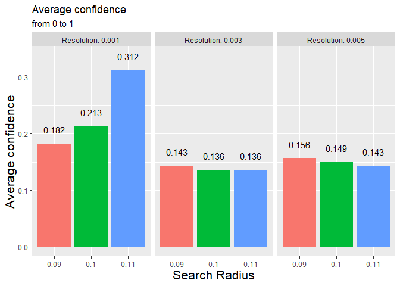
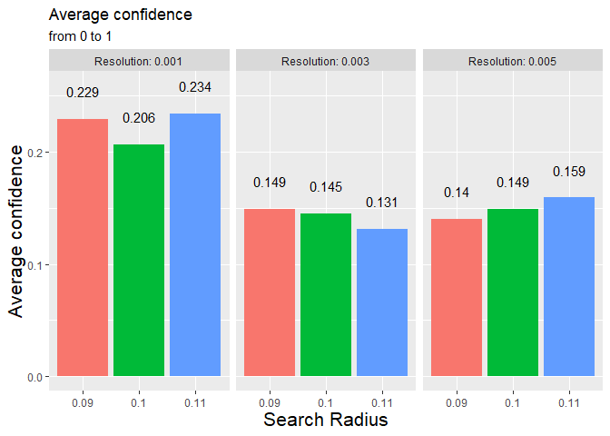

# Graphs {.tabset .tabset-fade .tabset-pills}

- NOTE THE CHANGE IN SCALE BETWEEN THE GRAPHS - SCALES MAY BE INDEPENDENT.

## Line Graphs

### Data from test circle of radius 0.09

<!-- -->


### Data from test circle of radius 0.1

<!-- -->


### Data from test circle of radius 0.11 

<!-- -->


## Distribution Graphs

### Distribution of method 1

<!-- -->


### Overall Distribution of method 1

<!-- -->


### Distribution of method 2

<!-- -->


### Overall Distribution of method 2

<!-- -->


## Bar Graphs

### Overall Average Highest Vote


```
## `summarise()` has grouped output by 'Search Radius'. You can override using the `.groups` argument.
## `summarise()` has grouped output by 'Search Radius'. You can override using the `.groups` argument.
```

<!-- -->


### Average highest vote for test circle of 0.09


```
## `summarise()` has grouped output by 'Search Radius'. You can override using the `.groups` argument.
## `summarise()` has grouped output by 'Search Radius'. You can override using the `.groups` argument.
```

<!-- -->


### Average highest vote for test circle of 0.1


```
## `summarise()` has grouped output by 'Search Radius'. You can override using the `.groups` argument.
## `summarise()` has grouped output by 'Search Radius'. You can override using the `.groups` argument.
```

<!-- -->


### Average highest vote for test circle of 0.11


```
## `summarise()` has grouped output by 'Search Radius'. You can override using the `.groups` argument.
## `summarise()` has grouped output by 'Search Radius'. You can override using the `.groups` argument.
```

<!-- -->


## Average Layer Mean

### Average Layer Vote


```
## `summarise()` has grouped output by 'Search Radius', 'Resolution', 'test_circle'. You can override using the `.groups` argument.
```

<!-- -->


### Average Confidence

#### Data from test circe of radius 0.09


```
## `summarise()` has grouped output by 'Resolution', 'Search Radius'. You can override using the `.groups` argument.
```

```
## Adding missing grouping variables: `Resolution`, `Search Radius`
```

```
## `summarise()` has grouped output by 'Resolution'. You can override using the `.groups` argument.
```

<!-- -->


#### Data from test circe of radius 0.1


```
## Adding missing grouping variables: `Resolution`, `Search Radius`
```

```
## `summarise()` has grouped output by 'Resolution'. You can override using the `.groups` argument.
```

<!-- -->


#### Data from test circe of radius 0.11


```
## Adding missing grouping variables: `Resolution`, `Search Radius`
```

```
## `summarise()` has grouped output by 'Resolution'. You can override using the `.groups` argument.
```

<!-- -->

