# Graphs {.tabset .tabset-fade .tabset-pills}

- NOTE THE CHANGE IN SCALE BETWEEN THE GRAPHS - SCALES MAY BE INDEPENDENT.

## Line Graphs

### Data from test circle of radius 0.05

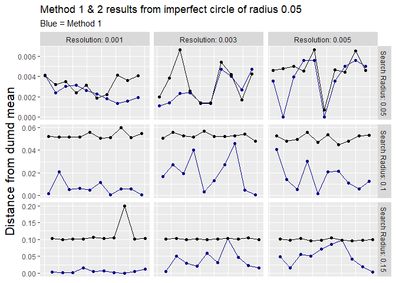<!-- -->


### Data from test circle of radius 0.1

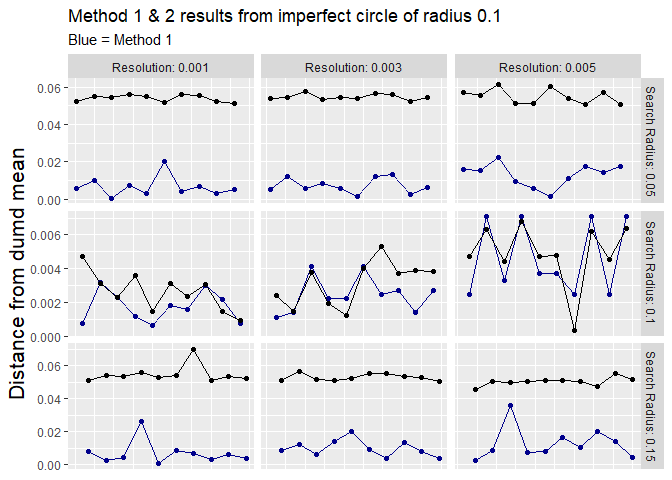<!-- -->


### Data from test circle of radius 0.15

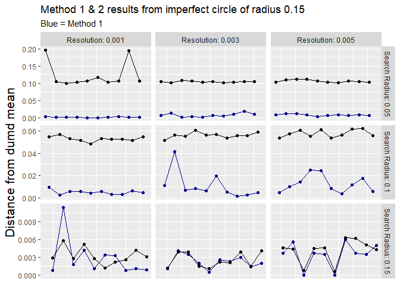<!-- -->


## Distribution Graphs

### Distribution of method 1

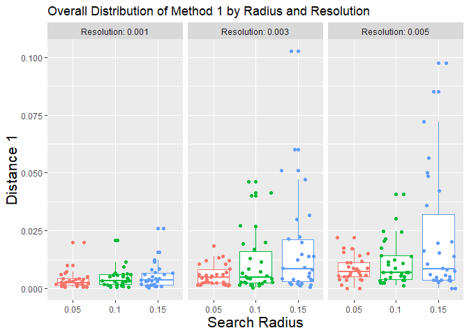<!-- -->


### Overall Distribution of method 1

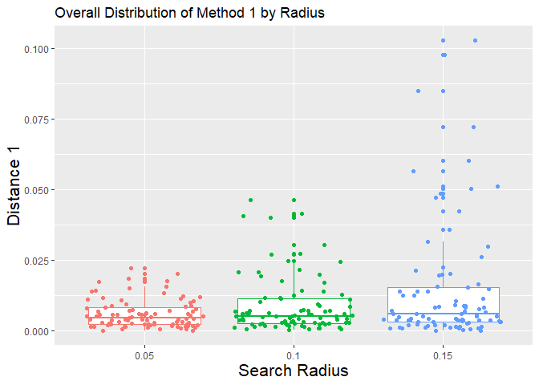<!-- -->


### Distribution of method 2

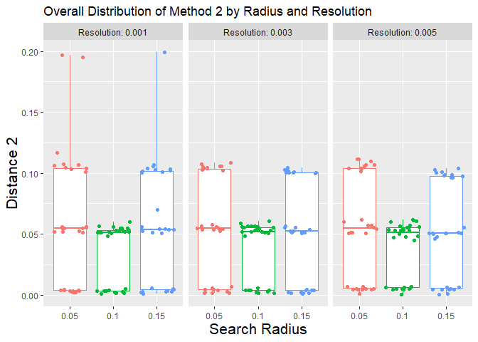<!-- -->


### Overall Distribution of method 2

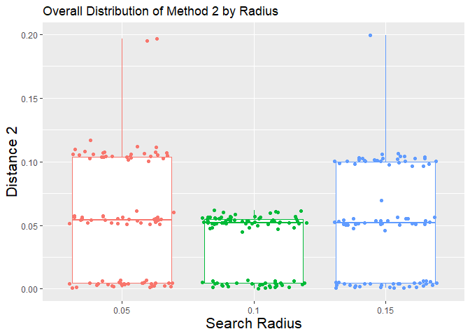<!-- -->


## Bar Graphs

### Overall Average Highest Votes


```
## `summarise()` has grouped output by 'Search Radius'. You can override using the `.groups` argument.
## `summarise()` has grouped output by 'Search Radius'. You can override using the `.groups` argument.
```

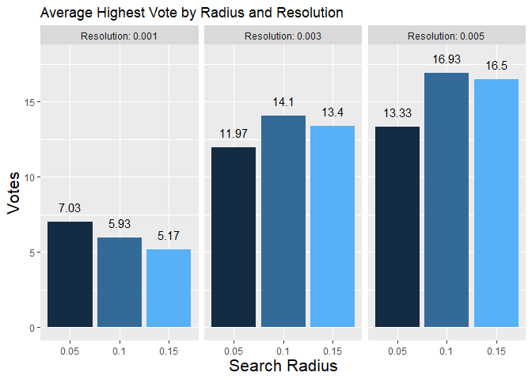<!-- -->


### Average highest vote for test circle of 0.05


```
## `summarise()` has grouped output by 'Search Radius'. You can override using the `.groups` argument.
## `summarise()` has grouped output by 'Search Radius'. You can override using the `.groups` argument.
```

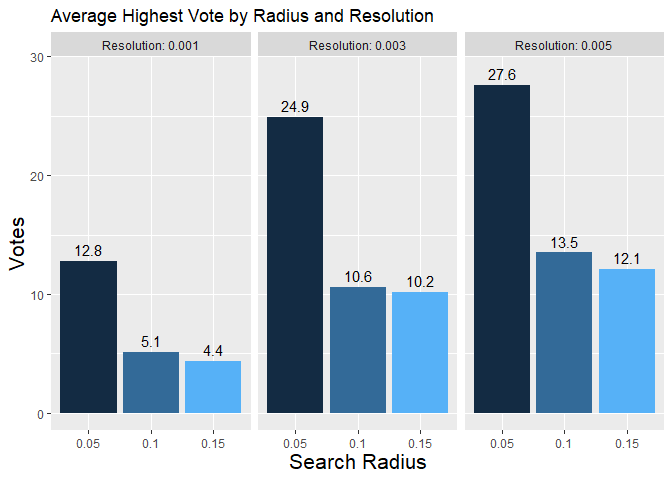<!-- -->


### Average highest vote for test circle of 0.1


```
## `summarise()` has grouped output by 'Search Radius'. You can override using the `.groups` argument.
## `summarise()` has grouped output by 'Search Radius'. You can override using the `.groups` argument.
```

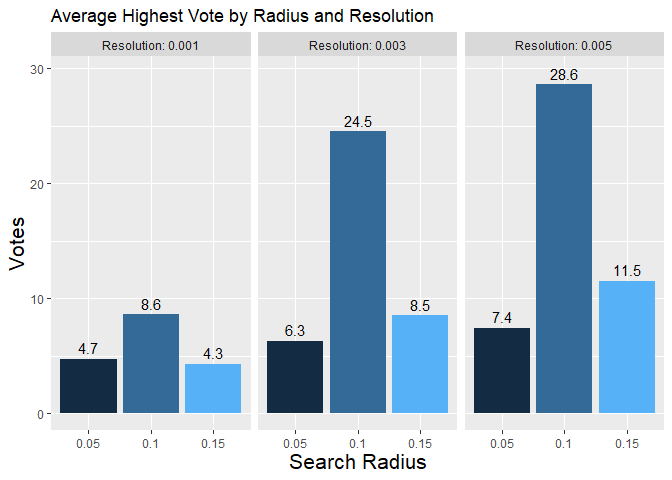<!-- -->


### Average highest vote for test circle of 0.15


```
## `summarise()` has grouped output by 'Search Radius'. You can override using the `.groups` argument.
## `summarise()` has grouped output by 'Search Radius'. You can override using the `.groups` argument.
```

<!-- -->


## Average Layer Mean

### Average Layer Vote


```
## `summarise()` has grouped output by 'Search Radius', 'Resolution', 'test_circle'. You can override using the `.groups` argument.
```

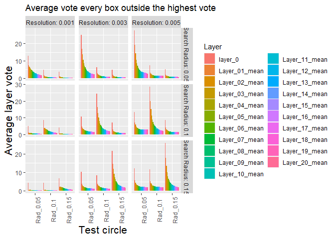<!-- -->


### Average Confidence

#### Data from test circe of radius 0.05


```
## `summarise()` has grouped output by 'Resolution', 'Search Radius'. You can override using the `.groups` argument.
```

```
## Adding missing grouping variables: `Resolution`, `Search Radius`
```

```
## `summarise()` has grouped output by 'Resolution'. You can override using the `.groups` argument.
```

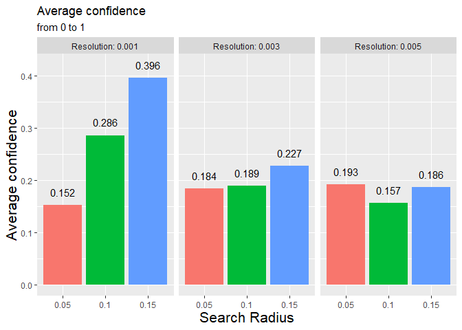<!-- -->


```
## `summarise()` has grouped output by 'Resolution', 'Search Radius'. You can override using the `.groups` argument.
```

<!--html_preserve--><div id="htmlwidget-03d600d0e264e55d7b8d" style="width:100%;height:auto;" class="datatables html-widget"></div>
<script type="application/json" data-for="htmlwidget-03d600d0e264e55d7b8d">{"x":{"filter":"none","data":[["1","2","3","4","5","6","7","8","9"],[0.05,0.05,0.05,0.1,0.1,0.1,0.15,0.15,0.15],["Rad_0.05","Rad_0.1","Rad_0.15","Rad_0.05","Rad_0.1","Rad_0.15","Rad_0.05","Rad_0.1","Rad_0.15"],[0.1520796381,0.2772389882,0.3342463606,0.2859687684,0.1729178902,0.3636266783,0.3956363104,0.3974673065,0.2059846086],[0.1840211749,0.2034731046,0.2461747677,0.1886797735,0.1940861369,0.2250418589,0.2268863456,0.1898919023,0.1877154772],[0.1925442155,0.1905017358,0.2173776015,0.1570354743,0.197667811,0.1924934869,0.1864712981,0.181783335,0.2010055749]],"container":"<table class=\"display\">\n  <thead>\n    <tr>\n      <th> <\/th>\n      <th>Search Radius<\/th>\n      <th>test_circle<\/th>\n      <th>0.001<\/th>\n      <th>0.003<\/th>\n      <th>0.005<\/th>\n    <\/tr>\n  <\/thead>\n<\/table>","options":{"columnDefs":[{"className":"dt-right","targets":[1,3,4,5]},{"orderable":false,"targets":0}],"order":[],"autoWidth":false,"orderClasses":false}},"evals":[],"jsHooks":[]}</script><!--/html_preserve-->


#### Data from test circe of radius 0.1


```
## Adding missing grouping variables: `Resolution`, `Search Radius`
```

```
## `summarise()` has grouped output by 'Resolution'. You can override using the `.groups` argument.
```

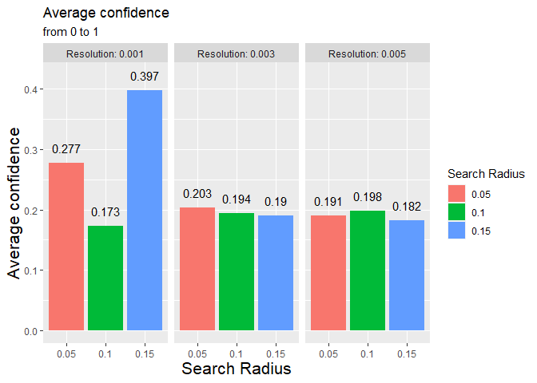<!-- -->

#### Data from test circe of radius 0.15


```
## Adding missing grouping variables: `Resolution`, `Search Radius`
```

```
## `summarise()` has grouped output by 'Resolution'. You can override using the `.groups` argument.
```

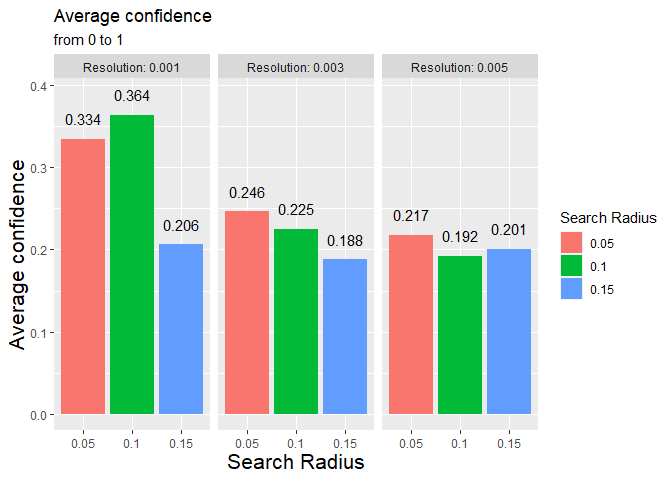<!-- -->
