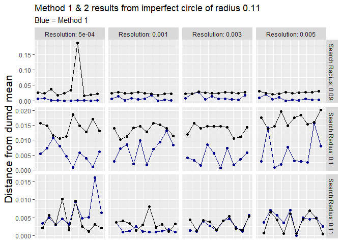
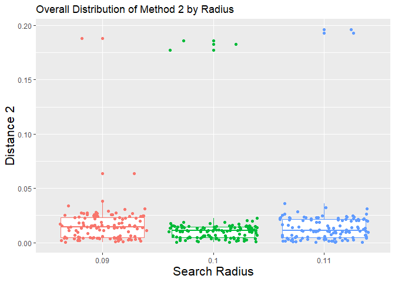
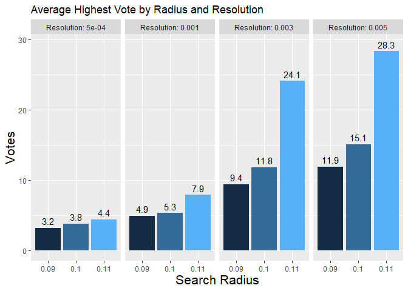
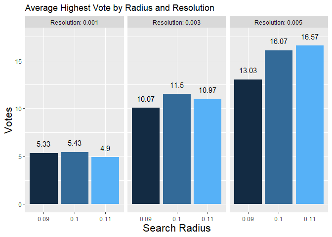

# Graphs {.tabset .tabset-fade .tabset-pills}

- NOTE THE CHANGE IN SCALE BETWEEN THE GRAPHS - SCALES MAY BE INDEPENDENT.

## Line Graphs {.tabset .tabset-pills}

### Orginal parameters - Gitter 0.01 Radii: 0.09, 0.1, 0.11

#### Data from test circle of radius 0.09

<!-- -->

#### Data from test circle of radius 0.1

<!-- -->

#### Data from test circle of radius 0.11

<!-- -->

### Gitter 0.03 with Radii: 0.09, 0.1, 0.11

#### Data from test circle of radius 0.09

<!-- -->

#### Data from test circle of radius 0.1

<!-- -->

#### Data from test circle of radius 0.11

<!-- -->

### Gitter 0.01 with Radii: 0.05, 0.1, 0.15 

#### Data from test circle of radius 0.05

<!-- -->

#### Data from test circle of radius 0.1

<!-- -->

#### Data from test circle of radius 0.15

<!-- -->

## Distribution Graphs {.tabset .tabset-pills}

### Orginal parameters - Gitter 0.01 Radii: 0.09, 0.1, 0.11

#### Distribution of method 1

<!-- -->

#### Overal Distribution of method 1

<!-- -->

#### Distribution of Method 2

<!-- -->

#### Overall Distribution of Method 2

<!-- -->

### Gitter 0.03 with Radii: 0.09, 0.1, 0.11

#### Distribution of method 1 

<!-- -->

#### Overall Distribution of method 1

<!-- -->

#### Distribution of method 2 

<!-- -->

#### Overall Distribution of method 2

<!-- -->

### Gitter 0.01 with Radii: 0.05, 0.1, 0.15

#### Distribution of method 1

<!-- -->

#### Overall Distribution of method 1

<!-- -->

#### Distribution of method 2

<!-- -->

#### Overall Distribution of method 2

<!-- -->

## Bar Graphs {.tabset .tabset-pills}

### Orginal parameters - Gitter 0.01 Radii: 0.09, 0.1, 0.11

#### Overall Average Highest Votes

<!-- -->

#### Average highest vote for test circle of 0.09

<!-- -->

#### Average highest vote for test circle of 0.1

<!-- -->

#### Average highest vote for test circle of 0.11

<!-- -->

### Gitter 0.03 with Radii: 0.09, 0.1, 0.11

#### Overall Highest Votes
<!-- -->

#### Average highest vote for test circle of radius 0.09

<!-- -->

#### Average highest vote for test circle of radius 0.1

<!-- -->

#### Average highest vote for test circle of radius 0.11

<!-- -->

### Gitter 0.01 with Radii: 0.05, 0.1, 0.15 

#### Overall Highest Votes

<!-- -->

#### Average highest vote for test circle of radius 0.05

<!-- -->

#### Average highest vote for test circle of radius 0.1

<!-- -->

#### Average highest vote for test circle of radius 0.15

<!-- -->

## Average Layer Mean {.tabset .tabset-pills}

### Orginal parameters - Gitter 0.01 Radii: 0.09, 0.1, 0.11

#### Average Layer Vote

<!-- -->

### Gitter 0.03 with Radii: 0.09, 0.1, 0.11

#### Average Layer Vote
<!-- -->

#### Average Confidence

### Gitter 0.01 with Radii: 0.05, 0.1, 0.15

#### Average Layer Vote
<!-- -->

## Confidence Graphs {.tabset .tabset-pills}

### Gitter 0.03 with Radii: 0.09, 0.1, 0.11

#### Data from test circle of radius 0.09

<!-- -->

#### Data from test circle of radius 0.1

<!-- -->

#### Data from test circle of radius 0.11

<!-- -->

### Gitter 0.01 with Radii: 0.05, 0.1, 0.15

#### Table of all results

<!--html_preserve-->

<!--/html_preserve-->

#### Data from test circle of radius 0.05

<!-- -->

#### Data from test circle of radius 0.1

<!-- -->

#### Data from test circle of radius 0.15

<!-- -->

