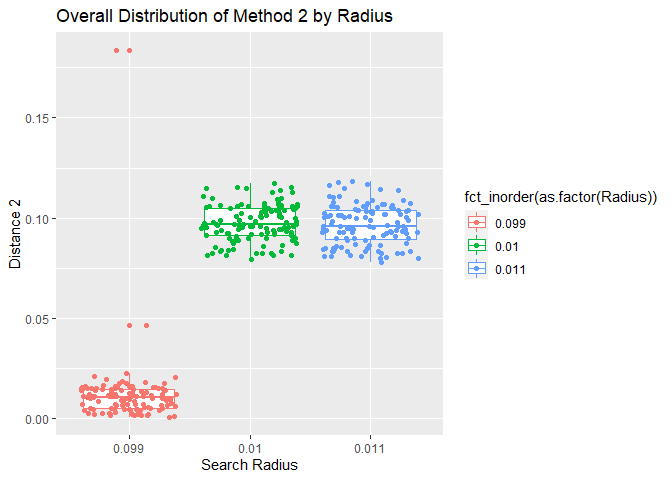
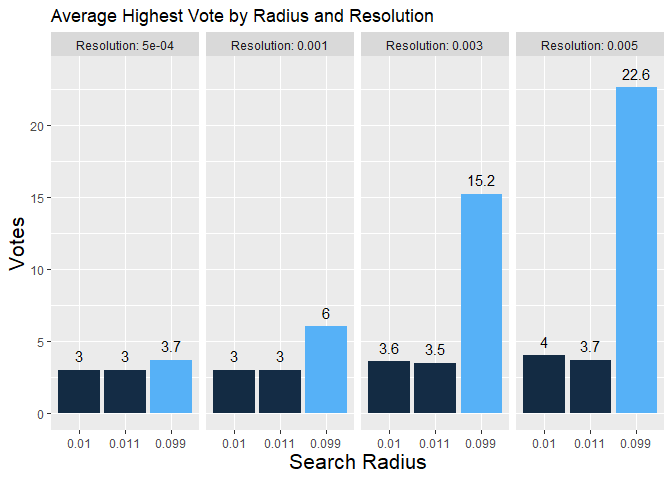
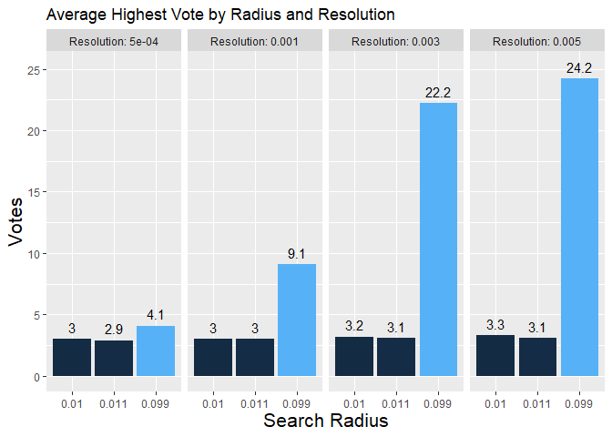
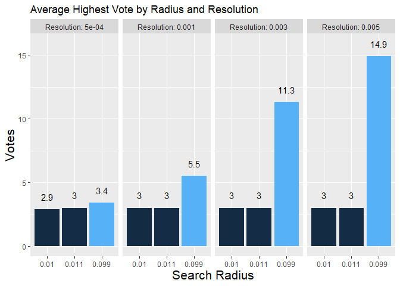

# Graphs {.tabset .tabset-fade .tabset-pills}

To do:  

- create boxplot graph to show the spread of the distribution for method 2
- Create a bar graph for an aver layer mean. 

## Line Graphs 

### Data from test circle of radius 0.099

<!-- -->

### Data from test circle of radius 0.01

<!-- -->


### Data from test circle of radius 0.011

<!-- -->


## Distribution graphs

### Distribution of method 1

<!-- -->

### Overal Distribution of method 1

<!-- -->

### Distribution of Method 2

<!-- -->

### Overall Distribution of Method 2

<!-- -->

## Bar plots of Average Votes

### Overall Average Highest Votes


```
## `summarise()` regrouping output by 'Radius' (override with `.groups` argument)
## `summarise()` regrouping output by 'Radius' (override with `.groups` argument)
```

<!-- -->

### Average highest vote for test circle of 0.09


```
## `summarise()` regrouping output by 'Radius' (override with `.groups` argument)
## `summarise()` regrouping output by 'Radius' (override with `.groups` argument)
```

<!-- -->


### Average highest vote for test circle of 0.01


```
## `summarise()` regrouping output by 'Radius' (override with `.groups` argument)
## `summarise()` regrouping output by 'Radius' (override with `.groups` argument)
```

<!-- -->


### Average highest vote for test circle of 0.011


```
## `summarise()` regrouping output by 'Radius' (override with `.groups` argument)
## `summarise()` regrouping output by 'Radius' (override with `.groups` argument)
```

<!-- -->


## Average Layer mean 


