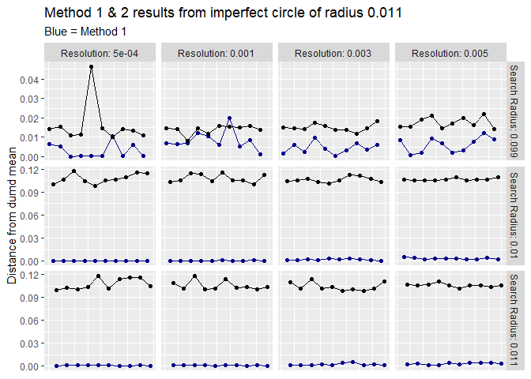

# Graphs {.tabset .tabset-fade .tabset-pills}

- NOTE THE CHANGE IN SCALE BETWEEN THE GRAPHS - SCALES MAY BE INDEPENDENT. 

## Line Graphs 

Insights: 

- Method 1 seems to always to more accurate, and it appears to be radius independent

- Method 1 seems to favor radius of .099 

- Method 2 also prefers a search radius of 0.099

### Data from test circle of radius 0.099

<!-- -->


### Data from test circle of radius 0.01

<!-- -->


### Data from test circle of radius 0.011

<!-- -->


## Distribution graphs

### Distribution of method 1

<!-- -->

### Overal Distribution of method 1

<!-- -->

### Distribution of Method 2

<!-- -->

### Overall Distribution of Method 2

<!-- -->

## Bar plots of Average Votes

Insights:

- Expected behavior on the bar graphs

### Overall Average Highest Votes


```
## `summarise()` regrouping output by 'Search Radius' (override with `.groups` argument)
## `summarise()` regrouping output by 'Search Radius' (override with `.groups` argument)
```

<!-- -->

### Average highest vote for test circle of 0.09


```
## `summarise()` regrouping output by 'Search Radius' (override with `.groups` argument)
## `summarise()` regrouping output by 'Search Radius' (override with `.groups` argument)
```

<!-- -->


### Average highest vote for test circle of 0.01


```
## `summarise()` regrouping output by 'Search Radius' (override with `.groups` argument)
## `summarise()` regrouping output by 'Search Radius' (override with `.groups` argument)
```

<!-- -->


### Average highest vote for test circle of 0.011


```
## `summarise()` regrouping output by 'Search Radius' (override with `.groups` argument)
## `summarise()` regrouping output by 'Search Radius' (override with `.groups` argument)
```

<!-- -->


## Average Layer mean 

Insights:

- Note the high confidence spikes of search radius of 0.099.


```
## `summarise()` regrouping output by 'Search Radius', 'Resolution', 'test_circle' (override with `.groups` argument)
```

<!-- -->


